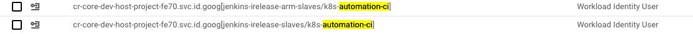

# How jenkins jobs get credentials to access cloud resources?

In the jenkins-irelease-slaves namespace, there is a service-account called: k8s-automation-ci

This SA is defined as a principal for automation-ci SA under services-project-211011
You can see it as a role of "Workload Identity User" under the permmisions page of automation-ci SA (under services-project-211011)

## For the refference, the command used to attach k8s-automation-ci to automation-ci is:

gcloud iam service-accounts add-iam-policy-binding automation-ci@services-project-211011.iam.gserviceaccount.com \
    --role roles/iam.workloadIdentityUser \
    --member "serviceAccount:cr-core-dev-host-project-fe70.svc.id.goog[jenkins-irelease-slaves/k8s-automation-ci]"

## Pointing k8s-automation-ci SA to IAM automation-ci SA

The k8s SA k8s-automation-ci is annotated with ref to the IAM SA with this command:

kubectl annotate serviceaccount k8s-automation-ci \
    --namespace jenkins-irelease-slaves \
    iam.gke.io/gcp-service-account=automation-ci@services-project-211011.iam.gserviceaccount.com

# Procedure #

## Attach k8s service account to "automation-ci" IAM service account ##

1. Authenticate to gcloud using "automation-ci" user
  - Connect to "Keeper" password manager.
  - Search for "2024 Service Account" and download "automation-ci.json" to your workstation.
  - Open terminal copy "automation-ci.json" to your current directory and run command `gcloud auth login --cred-file=automation-ci.json`.

2. Connect to the rellevante k8s cluster on gcp to get the SA details
  - Connect to GCP ovia Okta.
  - Select project "cr-core-dev-host-project" > kuberentes clusters > "management-devops-cluster".
  - Select "Connect" and copy the connect command to your terminal to connect to the cluster.
  - Run `kubectl -ns jenkins-irelease-slaves get sa` to list the namespace service accounts.
  - Write down the k8s SA user name that you want to attach to the IAM SA user.

3. Get the IAM SA "automation-ci" Organization project ID
  - Connect to GCP ovia Okta.
  - Select project "Admin-project".
  - Copy project ID - "services-project-211011".

4. Set the Organization project and attach k8s SA to the IAM SA
  - Set the project first `gcloud config set project services-project-211011`.
  - Run the command to attach k8s SA to the IAM SA:
    - `gcloud iam service-accounts add-iam-policy-binding automation-ci@services-project-211011.iam.gserviceaccount.com --role roles/iam.workloadIdentityUser --member "serviceAccount:cr-core-dev-host-project-fe70.svc.id.goog[jenkins-irelease-slaves/<k8s_sa_name>]"`.

5. Add annotaion with ref to the IAM SA to the selected k8s SA
  - Run the command:
    - `kubectl annotate serviceaccount <k8s_sa_name> --namespace jenkins-irelease-slaves iam.gke.io/gcp-service-account=automation-ci@services-project-211011.iam.gserviceaccount.com`.
  - Run `kubectl -ns jenkins-irelease-slaves get sa <k8s_sa_name> -o yaml` check annotation updated successfuly.
